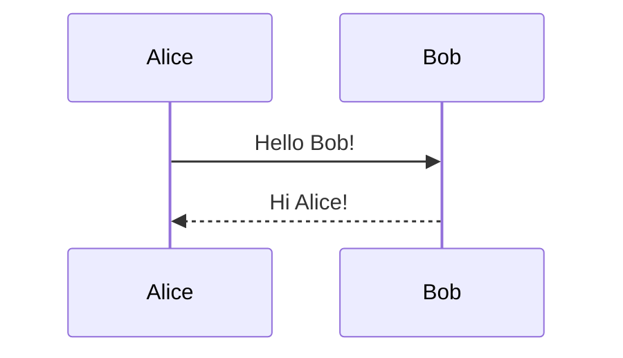
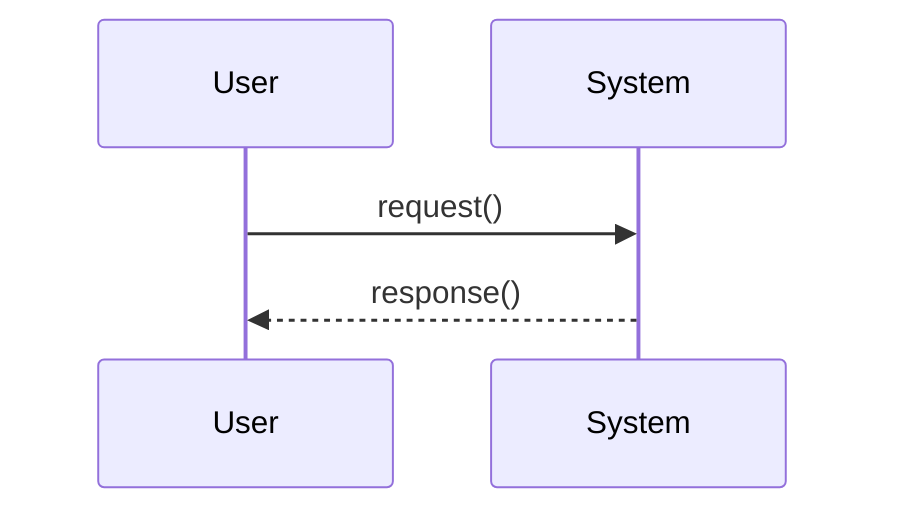

# Mermaid Test

This is a simple test to verify Mermaid rendering works on GitHub.

## Simple Sequence Diagram

## More Complex Diagram

**Note**: These diagrams will render automatically on GitHub. If viewing locally, you may need a Mermaid preview extension.
