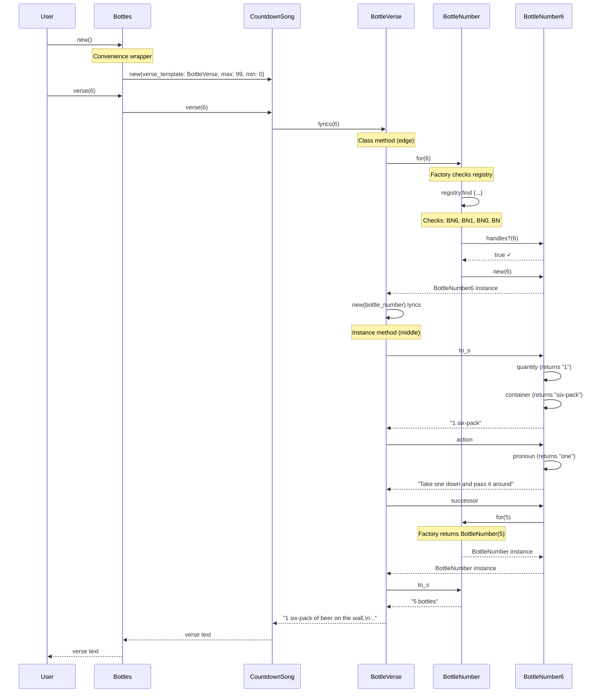
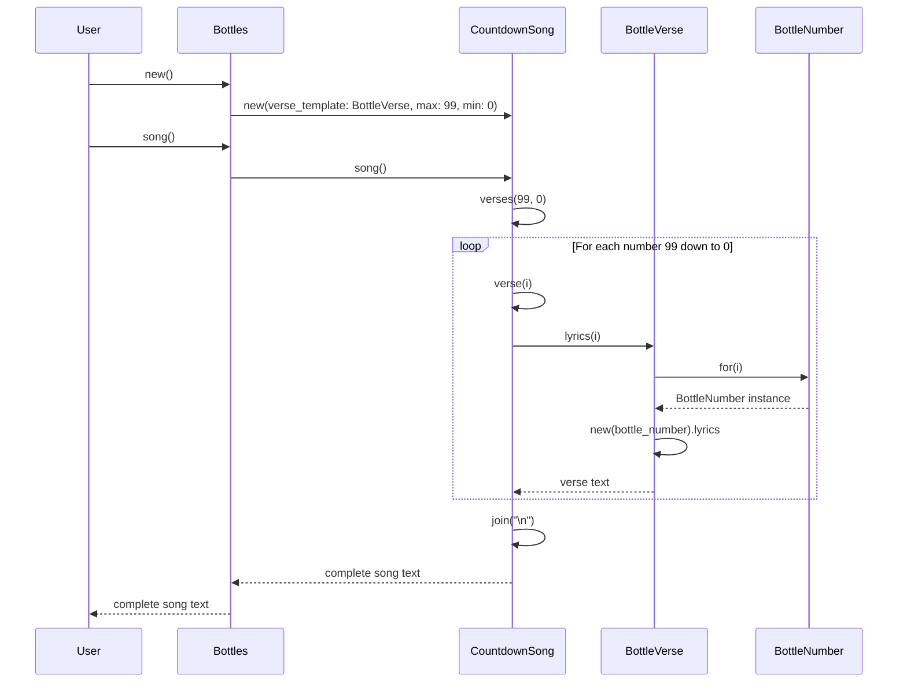
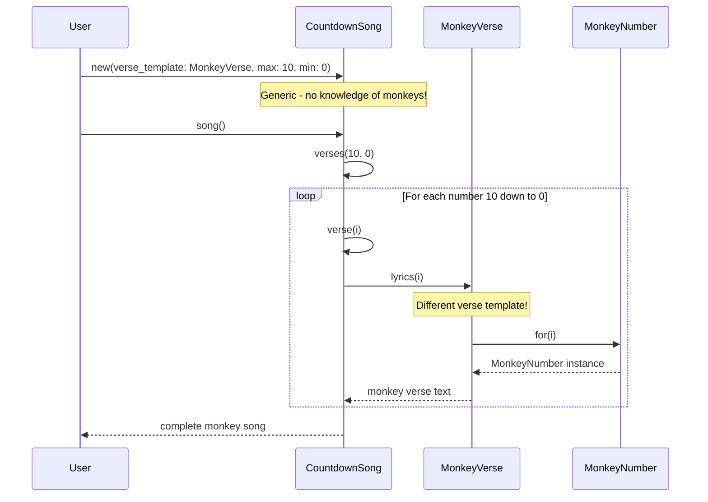

# 99 Bottles of OOP

A refactoring kata based on Sandi Metz's book "99 Bottles of OOP" - focusing on code smells, refactoring techniques, and discovering good object-oriented design.

## The Problem

Write a program that generates the lyrics to the classic counting song about beverages on a wall.

### Song Structure

The song counts down from 99 to 0, with each verse following a pattern:

**Typical verse (e.g., verse 99):**
```
99 bottles of beer on the wall, 99 bottles of beer.
Take one down and pass it around, 98 bottles of beer on the wall.
```

**Special cases:**
- **Verse 2**: Uses "1 bottle" (singular) in the last line
- **Verse 1**: Says "Take it down" instead of "Take one down", ends with "no more bottles"
- **Verse 0**: Starts with "No more bottles", says "Go to the store and buy some more"

### The Challenge

This kata is **NOT** about writing the song from scratch. It's about:

1. **Starting with working code** (even if it's messy)
2. **Identifying code smells** (duplication, complexity, poor naming)
3. **Refactoring systematically** to reveal better design
4. **Discovering abstractions** that emerge from the code itself

## What Makes This Kata Special

Unlike the Money kata (which builds features with TDD), 99 Bottles teaches:

- **Code Smells**: Recognize when code "smells bad"
- **Refactoring Recipes**: Specific techniques to improve code safely
- **Horizontal Refactoring**: Make many small changes in one dimension before changing dimension
- **Discovering Abstractions**: Let patterns emerge rather than planning upfront
- **Flocking Rules**: Conway's Rules for finding the right abstractions
- **Open/Closed Principle**: Code open for extension, closed for modification

## The Journey (9 Chapters)

### Part I: Foundations
- **Chapter 1**: Rediscovering Simplicity - What makes code simple?
- **Chapter 2**: Test Driving Shameless Green - Write the "obvious" solution first
- **Chapter 3**: Unearthing Concepts - Finding hidden abstractions

### Part II: Refactoring
- **Chapter 4**: Practicing Horizontal Refactoring - Flocking to DRY
- **Chapter 5**: Separating Responsibilities - Extract classes
- **Chapter 6**: Achieving Openness - Open/Closed Principle
- **Chapter 7**: Manufacturing Intelligence - Factory patterns

### Part III: Design
- **Chapter 8**: Developing a Programming Aesthetic - Code quality metrics
- **Chapter 9**: Reaping the Benefits of Design - Ease of adding features

## Key Concepts

### Code Smells
- **Duplication**: Same logic in multiple places
- **Inconsistency**: Different ways of doing the same thing
- **Poor Naming**: Unclear or missing names for concepts
- **Complexity**: Nested conditionals, ternaries within ternaries

### Refactoring Techniques
- **Extract Method**: Pull logic into named methods
- **Replace Conditional with Polymorphism**: Objects instead of if/else
- **Introduce Parameter Object**: Group related parameters
- **Remove Dead Code**: Delete unused paths

### Flocking Rules (Conway's Rules)
1. Select things that are most alike
2. Find the smallest difference between them
3. Make the smallest change to remove that difference

Repeat until you see patterns emerge, then extract abstractions.

## Ruby vs Python

This kata was originally written in Ruby, but we'll implement it in Ruby to:
- Learn Ruby's object-oriented features
- Experience Ruby's "everything is an object" philosophy
- See how Ruby enables elegant DSLs and refactoring

### Ruby Basics for Python Programmers

```ruby
# Ruby                          # Python equivalent
class Bottles                   class Bottles:
  def song                        def song(self):
    verses(99, 0)                   return self.verses(99, 0)
  end
end

# Calling methods
bottles = Bottles.new           bottles = Bottles()
bottles.song                    bottles.song()

# Blocks (Ruby's lambda)
[1,2,3].map { |n| n * 2 }      [n * 2 for n in [1,2,3]]

# String interpolation
"#{n} bottles"                  f"{n} bottles"

# Everything is an object!
5.times { puts "Hi" }           # No Python equivalent
"hello".upcase                  "hello".upper()
```

## Running Tests

```bash
# Run tests
ruby test/bottles_test.rb

# Or with minitest directly
ruby -I lib:test test/bottles_test.rb
```

## Learning Goals

By the end of this kata, you will:

1. **Recognize code smells** intuitively
2. **Apply refactoring recipes** systematically
3. **Discover good abstractions** from messy code
4. **Understand Open/Closed Principle** through practice
5. **Experience Ruby's OO philosophy** hands-on
6. **Learn when to stop refactoring** (good enough beats perfect)

## The "Shameless Green" Philosophy

Sandi Metz teaches: **First, make it work. Then, make it right.**

The first solution should be:
- **Simple** enough to understand
- **Complete** (all tests pass)
- **Shameless** about duplication

Only THEN do you refactor, guided by:
- Tests (your safety net)
- Code smells (your nose)
- Flocking rules (your process)

## Chapter-by-Chapter Progress

### **Chapter 2: Test Driving Shameless Green** ✅ COMPLETE!

**Step 1: First Test (Verse 99)**
- ✅ Created `test/bottles_test.rb` with test for verse 99
- ✅ Created `lib/bottles.rb` with Bottles class
- ✅ Followed TDD: Red (no file) → Red (no class) → Red (no method) → Red (wrong return) → Green!
- ✅ Hardcoded the entire verse 99 lyrics - **Shameless!**

**Step 2: Generalization (Verse 3)**
- ✅ Added test for verse 3
- ✅ Used Ruby string interpolation `#{number}` and `#{number-1}`
- ✅ Both tests passing

**Step 3: Special Cases**
- ✅ Verse 2: Added ternary for singular "bottle" when count is 1
- ✅ Verse 1: Special case with "Take it down" and "no more bottles"
- ✅ Verse 0: Completely different verse - "No more" and "Go to the store"

**Final Shameless Green Implementation:**
```ruby
class Bottles
  def verse(number)
    if number == 0
      "No more bottles of beer on the wall, " +
      "no more bottles of beer.\n" +
      "Go to the store and buy some more, " +
      "99 bottles of beer on the wall.\n"
    elsif number == 1
      "1 bottle of beer on the wall, " +
      "1 bottle of beer.\n" +
      "Take it down and pass it around, " +
      "no more bottles of beer on the wall.\n"
    else
      "#{number} bottles of beer on the wall, " +
      "#{number} bottles of beer.\n" +
      "Take one down and pass it around, " +
      "#{number-1} #{(number-1) == 1 ? 'bottle' : 'bottles'} of beer on the wall.\n"
    end
  end
end
```

**Code Smells Introduced (Intentionally!):**
- **Duplication**: "bottles of beer on the wall" repeated many times
- **Conditionals**: if/elsif/else creates complexity
- **String duplication**: Similar patterns across all branches
- **Mixed abstraction levels**: Ternary within string interpolation

**Status**: 5 tests passing (verses 99, 3, 2, 1, 0)
**Key Learning**: Make it work first! We'll refactor in later chapters.

---

### **Chapter 3: Unearthing Concepts** ⬅️ WE ARE HERE

**The New Requirement**: Output "1 six-pack" where it currently says "6 bottles"

**Key Concepts Introduced:**
- **Open/Closed Principle**: Code should be open for extension, closed for modification
- **Code Smells**: Identified Duplicated Code and Switch Statements
- **Flocking Rules**: Systematic approach to refactoring
  1. Select the things that are most alike
  2. Find the smallest difference between them
  3. Make the simplest change to remove that difference

**Refactoring Journey:**

**Step 1: Add song() and verses() methods**
- ✅ `song()`: Returns full song (verses 99 to 0)
- ✅ `verses(upper, lower)`: Returns range of verses joined with newlines
- Preparing for later refactoring

**Step 2: Extract container() - Remove verse 2 special case**
- ✅ Applied Flocking Rules: Compared else branch with verse 2
- ✅ Found smallest difference: "bottle" vs "bottles"
- ✅ Extracted `container(number)` method
- ✅ Result: else branch now handles verse 2 correctly!
- Reduced from 4 branches to 3 branches

**Step 3: Extract quantity() and action() - Remove verse 1 special case**
- ✅ Compared else branch with verse 1
- ✅ Found differences: "Take it down" vs "Take one down", "no more" vs number
- ✅ Extracted `quantity(number)`: handles "no more" vs number.to_s
- ✅ Extracted `action(number)`: handles "Take it down" vs "Take one down"
- ✅ Generalized else branch to use all helper methods
- ✅ Result: Reduced from 3 branches to 2 branches!

**Current Implementation:**
```ruby
class Bottles
  def song
    verses(99, 0)
  end

  def verses(upper, lower)
    upper.downto(lower).collect { |i| verse(i) }.join("\n")
  end

  def verse(number)
    if number == 0
      "No more bottles of beer on the wall, " +
      "no more bottles of beer.\n" +
      "Go to the store and buy some more, " +
      "99 bottles of beer on the wall.\n"
    else
      "#{quantity(number)} #{container(number)} of beer on the wall, " +
      "#{quantity(number)} #{container(number)} of beer.\n" +
      "#{action(number)}, " +
      "#{quantity(number-1)} #{container(number-1)} of beer on the wall.\n"
    end
  end

  def container(number)
    number == 1 ? 'bottle' : 'bottles'
  end

  def quantity(number)
    number == 0 ? 'no more' : number.to_s
  end

  def action(number)
    number == 1 ? 'Take it down and pass it around' : 'Take one down and pass it around'
  end
end
```

**What We Achieved:**
- **Before**: 4 conditional branches (verse 0, 1, 2, else) with lots of duplication
- **After**: 2 conditional branches (verse 0, else) with extracted helper methods
- **Verses 1-99** all handled by single else branch using polymorphic helper methods
- **Verse 0** still special (completely different structure)

**Key Learnings:**
- **Flocking Rules work!** We didn't need to know the final design upfront
- **Abstractions emerged** from systematic application of simple rules
- **Small steps are safe** - tests passed after every change
- **Faith in the process** - nibbling away at code smells reveals the path forward

**Step 4: Extract pronoun() - Further DRY**
- ✅ Created `pronoun(number)` combining `quantity()` and `container()`
- ✅ Eliminates repeated calls to both methods
- ✅ Applied to verse 0 and else branch
- Code now very DRY!
- Note: "pronoun" may not be the perfect domain name - could be "quantity_phrase" or similar

**Step 5: Implement Six-Pack Requirement - OPEN/CLOSED ACHIEVED!** ✅
- ✅ Added special case in `pronoun()` for number == 6
- ✅ Returns "1 six-pack" instead of "6 bottles"
- ✅ Added tests for verse 6 and verse 7
- **KEY**: Only modified `pronoun()` method - did NOT touch `verse()` method!
- **This is the Open/Closed Principle in action!**

**Final Implementation (Chapter 3):**
```ruby
def pronoun(number)
  if number == 6
    "1 six-pack"
  else
    "#{quantity(number)} #{container(number)}"
  end
end
```

**What Changed to Add Six-Pack:**
- **Before refactoring**: Would need to add 2 more branches to conditional (verse 6, verse 7)
- **After refactoring**: Only 1 line change in 1 method (`pronoun()`)
- **Code was OPEN** to the new requirement!

**Status**: 8 tests passing (including verse 6 and verse 7)
**Chapter 3 Complete!** Successfully demonstrated:
- Flocking Rules remove duplication systematically
- Abstractions emerge from process, not upfront design
- Open/Closed Principle makes code extensible

---

### **Chapter 4: Practicing Horizontal Refactoring** ✅ COMPLETE!

**The Power of Systematic Refactoring**

Continuing with Flocking Rules to eliminate ALL conditionals from `verse()` method.

**Step 1: Introduce successor() - The "What Comes Next" Abstraction**
- ✅ Discovered deep abstraction: What verse number comes next?
- ✅ Created `successor(number)` method returning `number - 1` normally, `99` for verse 0
- ✅ Replaced all `number-1` references with `successor(number)`
- **Key Insight**: This abstraction wasn't obvious upfront - emerged from systematic refactoring!

**Step 2: Extend action() to Handle Verse 0**
- ✅ Added verse 0 case to `action()`: "Go to the store and buy some more"
- ✅ Updated verse 0 to use `action(number)` instead of hardcoded string
- ✅ Result: Verse 0 and else branch now STRUCTURALLY IDENTICAL!

**Step 3: Final Unification - DELETE THE CONDITIONAL! 🎉**
- ✅ Noticed only difference: verse 0 capitalizes first pronoun
- ✅ Made else branch also capitalize first pronoun
- ✅ **Deleted the entire if/else conditional**
- ✅ All 8 tests still passing!

**Final verse() Implementation (Chapter 4):**
```ruby
def verse(number)
  "#{pronoun(number).capitalize} of beer on the wall, " +
  "#{pronoun(number)} of beer.\n" +
  "#{action(number)}, " +
  "#{pronoun(successor(number))} of beer on the wall.\n"
end
```

**The Journey:**
- **Chapter 2 Start**: 4 conditional branches (verse 0, 1, 2, else) with massive duplication
- **Chapter 3 Progress**: 2 conditional branches (verse 0, else) with extracted helpers
- **Chapter 4 Achievement**: 0 conditional branches - SINGLE implementation handles ALL cases!

**Helper Methods Summary:**
- `container(number)`: "bottle" vs "bottles"
- `quantity(number)`: "no more" vs number.to_s
- `action(number)`: Handles verses 0, 1, and rest differently
- `pronoun(number)`: Combines quantity+container, handles six-pack
- `successor(number)`: What verse comes next (0→99, else→number-1)

**What We Learned:**
- **Horizontal Refactoring**: Make many small changes in one dimension before changing dimension
- **Flocking Rules Work**: Systematic application reveals hidden abstractions
- **Faith in Process**: Don't need to know the end design - it emerges from small steps
- **Polymorphism via Methods**: Methods handle variation, not conditionals
- **Deep Abstractions**: `successor()` wasn't obvious - emerged from removing duplication

**Current Code State (After Chapter 4):**
```ruby
class Bottles
  def song
    verses(99, 0)
  end

  def verses(upper, lower)
    upper.downto(lower).collect { |i| verse(i) }.join("\n")
  end

  def verse(number)
    "#{pronoun(number).capitalize} of beer on the wall, " +
    "#{pronoun(number)} of beer.\n" +
    "#{action(number)}, " +
    "#{pronoun(successor(number))} of beer on the wall.\n"
  end

  def container(number)
    number == 1 ? 'bottle' : 'bottles'
  end

  def quantity(number)
    number == 0 ? 'no more' : number.to_s
  end

  def action(number)
    if number == 0
      'Go to the store and buy some more'
    elsif number == 1
      'Take it down and pass it around'
    else
      'Take one down and pass it around'
    end
  end

  def pronoun(number)
    if number == 6
      "1 six-pack"
    else
      "#{quantity(number)} #{container(number)}"
    end
  end

  def successor(number)
    if number == 0
      99
    else
      number - 1
    end
  end
end
```

**Comparison**:
- **Lines of code**: ~50 lines (from ~40 in Chapter 2)
- **verse() conditionals**: 0 (from 4 in Chapter 2!)
- **Helper methods**: 6 (container, quantity, action, pronoun, successor, verses)
- **Cyclomatic complexity of verse()**: 1 (no branches!)
- **Tests passing**: 8/8
- **Open/Closed**: Can add new requirements by modifying helper methods only

**Status**: 8 tests passing, verse() method has ZERO conditionals!
**Chapter 4 Complete!** Successfully eliminated all conditionals through systematic horizontal refactoring.

---

### **Chapter 5: Separating Responsibilities** ✅ COMPLETE!

**Curing Primitive Obsession with Extract Class**

Identified the dominant code smell and extracted a new class to represent bottle numbers.

**Code Smell Identified: Primitive Obsession**
- The "flocked five" methods (`container`, `quantity`, `action`, `pronoun`, `successor`) all:
  - Take `number` as an argument (representing a **bottle number**, not a verse number)
  - Have the same shape (conditional testing `number` for equality)
  - Depend more on the `number` argument than on the class as a whole
  - Could be considered "private"
- This is **Primitive Obsession** - using a primitive (Integer) to represent a domain concept (bottle number)

**The Cure: Extract Class**
- Recipe: Extract the methods that obsess on the primitive into a new class
- New class name: `BottleNumber` (named after what it **is**, not what it **does**)
- BottleNumber represents a **number**, not a bottle (it's an idea/abstraction, not a thing)

**Step 1: Create Empty BottleNumber Class**
- ✅ Created empty `BottleNumber` class
- ✅ Tests still passing (parsing new code)

**Step 2: Copy Methods to BottleNumber**
- ✅ Copied all five methods (`container`, `quantity`, `action`, `pronoun`, `successor`) to BottleNumber
- ✅ Original methods still in Bottles (duplication is temporary)
- ✅ Tests still passing (parsing duplicated code)

**Step 3: Add attr_reader and initialize**
- ✅ Added `attr_reader :number` to create number() method
- ✅ Added `initialize(number)` to set `@number` instance variable
- ✅ BottleNumber now holds onto the number value

**Step 4: Wire Bottles to Forward to BottleNumber**
- ✅ Changed each Bottles method to forward to BottleNumber:
  - `BottleNumber.new(number).quantity(number)` (parse and execute)
  - Then moved to last line (parse, execute, use result)
  - Then deleted old implementation
- ✅ Repeated for all five methods
- ✅ Tests passing - BottleNumber fully wired in!

**Step 5: Remove Redundant number Arguments**
- BottleNumber instances **know** their number, so methods don't need arguments
- **Recipe for removing arguments**:
  1. Rename parameter to `delete_me=nil` (makes it optional)
  2. Remove argument from all senders
  3. Delete the parameter entirely
- ✅ Applied to `quantity`, `container`, `action`, `pronoun`, `successor`
- **Caught Issue**: `pronoun` calls `quantity(number)` and `container(number)` internally!
  - Fixed by updating BottleNumber.pronoun to call `quantity` and `container` without arguments
  - This is like the book's example with `action` calling `pronoun`

**Step 6: Cache BottleNumber Instances in verse()**
- ✅ Created `bottle_number = BottleNumber.new(number)` in verse()
- ✅ Created `next_bottle_number = BottleNumber.new(bottle_number.successor)`
- ✅ Updated template to send messages to cached objects:
  - `bottle_number.pronoun.capitalize`
  - `bottle_number.pronoun`
  - `bottle_number.action`
  - `next_bottle_number.pronoun`

**Step 7: Delete Forwarding Methods**
- ✅ Deleted all five forwarding methods from Bottles
- ✅ Bottles.verse() now talks directly to BottleNumber objects
- ✅ Tests still passing!

**Key Insights from Chapter 5**:

**On Object-Oriented Design**:
- **Conditionals indicate missing objects**: The flocked five took an argument and examined it - deeply non-OO!
- **Objects should be message senders, not examiners**: Want to send messages to smart objects, not supply behavior for dumb ones
- **Modeling abstractions**: BottleNumber is an **idea** (a number with bottle-ish behavior), not a **thing** (an actual bottle)
- **Naming**: Classes are named after what they **are** (BottleNumber), methods after what they **mean**

**On Immutability**:
- **Immutable objects are easier to reason about**: They never change, so what you see at creation is what you get
- **Easier to test**: No need to set up complex state changes
- **Thread safe**: Can't break shared state if it doesn't change
- **Performance concerns often premature**: Create new objects freely, optimize later if needed

**On Caching**:
- **Caching is easy, cache invalidation is hard**: Knowing when to update a cache adds complexity
- **Premature optimization raises costs**: Humans are bad at predicting performance problems
- **Write simple code first**: Measure performance, then optimize slowest parts
- **verse() creates 2 BottleNumber instances** (down from 9 if we didn't cache!)

**On Liskov Violations**:
- **successor still returns a number, not a BottleNumber**: This violates the principle!
- **Promises broken**: Method named `successor` should return an object with same API as receiver
- **Temporary shameless code**: Line 12 shows the violation: `BottleNumber.new(bottle_number.successor)`
- We'll fix this in the next chapter

**Final Code State (After Chapter 5):**
```ruby
class Bottles
  def song
    verses(99, 0)
  end

  def verses(upper, lower)
    upper.downto(lower).collect { |i| verse(i) }.join("\n")
  end

  def verse(number)
    bottle_number = BottleNumber.new(number)
    next_bottle_number = BottleNumber.new(bottle_number.successor)

    "#{bottle_number.pronoun.capitalize} of beer on the wall, " +
    "#{bottle_number.pronoun} of beer.\n" +
    "#{bottle_number.action}, " +
    "#{next_bottle_number.pronoun} of beer on the wall.\n"
  end
end

class BottleNumber
  attr_reader :number

  def initialize(number)
    @number = number
  end

  def container
    number == 1 ? 'bottle' : 'bottles'
  end

  def quantity
    number == 0 ? 'no more' : number.to_s
  end

  def action
    if number == 0
      'Go to the store and buy some more'
    elsif number == 1
      'Take it down and pass it around'
    else
      'Take one down and pass it around'
    end
  end

  def pronoun
    if number == 6
      "1 six-pack"
    else
      "#{quantity} #{container}"
    end
  end

  def successor
    if number == 0
      99
    else
      number - 1
    end
  end
end
```

**Comparison**:
- **Classes**: 2 (was 1)
- **Bottles methods**: 3 (song, verses, verse)
- **BottleNumber methods**: 6 (container, quantity, action, pronoun, successor, initialize)
- **Conditionals in verse()**: 0 (still!)
- **Conditionals total**: 5 (in BottleNumber helper methods)
- **Responsibilities**: Separated! Bottles knows about verses, BottleNumber knows about bottle numbers
- **Tests passing**: 8/8
- **Known issues**: Liskov violation in successor (returns Integer, not BottleNumber)

**What We Achieved**:
- ✅ Extracted BottleNumber class to cure Primitive Obsession
- ✅ Bottles is now free of conditionals
- ✅ Clear separation of responsibilities
- ✅ verse() method is a clean template sending messages to objects
- ✅ Immutable BottleNumber objects
- ✅ Simple caching reduces object creation

**What Still Needs Work**:
- ❌ successor() returns Integer instead of BottleNumber (Liskov violation)
- ❌ Still have conditionals (moved to BottleNumber)
- ❌ No unit tests for BottleNumber (relies on Bottles tests)
- ❌ Code not yet open to six-pack requirement

**Status**: 8 tests passing, 2 classes with separated responsibilities!
**Chapter 5 Complete!** Successfully extracted BottleNumber class and cured Primitive Obsession.

---

### **Chapter 6: Achieving Openness** ✅ COMPLETE!

**Replacing Conditionals with Polymorphism**

Fixed the Liskov violation and applied the Replace Conditional with Polymorphism pattern to achieve true Open/Closed behavior.

**The Problem: Liskov Substitution Principle Violation**
- `successor()` returns an Integer, not a BottleNumber
- Evidence: Line 12 in verse shows `BottleNumber.new(bottle_number.successor)`
- This violates LSP - methods should return objects with the same API as the receiver
- Makes code fragile and adds dependencies

**Code Smell Identified: Switch Statement**
- The conditionals in BottleNumber represent **type variations**
- Different bottle numbers behave differently (0, 1, 6, rest)
- Classic case for polymorphism: Use objects instead of conditionals

**Step 1: Remove Data Clump - Add to_s Method**
- ✅ Identified Data Clump: `quantity` and `container` always appear together in verse template
- ✅ Added `to_s` method to BottleNumber that delegates to `pronoun`
- ✅ Updated verse template to use `"#{bottle_number}"` instead of `"#{bottle_number.pronoun}"`
- **Key Learning**: Ruby's string interpolation automatically calls `to_s`!
- **Result**: Simplified template, made pronoun's purpose clearer

**Step 2: Create Empty BottleNumber0 Subclass**
- ✅ Created `class BottleNumber0 < BottleNumber` with no methods
- ✅ All behavior inherited from BottleNumber
- ✅ Tests still passing (establishing base for polymorphism)

**Step 3: Move Specialized Behavior to BottleNumber0**
- ✅ Moved `quantity` override to BottleNumber0 (returns "no more")
- ✅ Removed verse 0 case from BottleNumber.quantity
- ✅ Moved `action` override to BottleNumber0 (returns "Go to the store...")
- ✅ Removed verse 0 case from BottleNumber.action
- ✅ Moved `successor` override to BottleNumber0 (returns 99)
- ✅ Removed verse 0 case from BottleNumber.successor

**Step 4: Introduce Factory Pattern**
- ✅ Created `bottle_number_for(number)` factory method in Bottles
- ✅ Factory decides which class to instantiate based on number
- ✅ Returns BottleNumber0 for 0, BottleNumber for everything else
- ✅ Updated verse to use factory instead of `BottleNumber.new`

**Step 5: Create BottleNumber1 Subclass**
- ✅ Created `class BottleNumber1 < BottleNumber`
- ✅ Moved `container` override (returns "bottle" singular)
- ✅ Moved `action` override (returns "Take it down...")
- ✅ Removed verse 1 cases from BottleNumber base class
- ✅ Updated factory to handle BottleNumber1

**Step 6: Move Factory to BottleNumber.for Class Method**
- ✅ Moved factory from Bottles to `BottleNumber.for(number)` class method
- ✅ Changed from if/elsif to case/when for clarity
- ✅ Updated verse to use `BottleNumber.for(number)`
- **Better responsibility**: BottleNumber knows how to create the right kind

**Step 7: Fix Liskov Violation - The Safe Way**
- **Strategy**: Use guard clause to enable gradual transition
- ✅ Added guard clause to factory: `return number if number.kind_of?(BottleNumber)`
- ✅ Updated `BottleNumber.successor` to return `BottleNumber.for(number - 1)`
- ✅ Updated `BottleNumber0.successor` to return `BottleNumber.for(99)`
- ✅ Simplified verse to: `next_bottle_number = bottle_number.successor`
- ✅ Removed guard clause after transition complete
- **Result**: successor now returns BottleNumber, Liskov violation FIXED!

**Final Code State (After Chapter 6):**
```ruby
class Bottles
  def verse(number)
    bottle_number = BottleNumber.for(number)
    next_bottle_number = bottle_number.successor

    "#{bottle_number} of beer on the wall, ".capitalize +
    "#{bottle_number} of beer.\n" +
    "#{bottle_number.action}, " +
    "#{next_bottle_number} of beer on the wall.\n"
  end
end

class BottleNumber
  def self.for(number)
    case number
    when 0
      BottleNumber0
    when 1
      BottleNumber1
    else
      BottleNumber
    end.new(number)
  end

  def to_s
    pronoun
  end

  def container
    'bottles'
  end

  def quantity
    number.to_s
  end

  def action
    'Take one down and pass it around'
  end

  def pronoun
    if number == 6
      "1 six-pack"
    else
      "#{quantity} #{container}"
    end
  end

  def successor
    BottleNumber.for(number - 1)
  end
end

class BottleNumber0 < BottleNumber
  def quantity
    'no more'
  end

  def action
    'Go to the store and buy some more'
  end

  def successor
    BottleNumber.for(99)
  end
end

class BottleNumber1 < BottleNumber
  def container
    'bottle'
  end

  def action
    'Take it down and pass it around'
  end
end
```

**What We Achieved:**
- ✅ **Liskov violation fixed**: successor returns BottleNumber, not Integer
- ✅ **Polymorphism achieved**: 3 classes (BottleNumber, BottleNumber0, BottleNumber1)
- ✅ **Factory pattern**: `BottleNumber.for(number)` creates right subclass
- ✅ **Conditionals reduced**: Moved from base class to polymorphic overrides
- ✅ **Data Clump removed**: to_s method simplifies template
- ✅ **Open/Closed improved**: Can add BottleNumber6 subclass for six-pack behavior

**Comparison**:
- **Classes**: 4 (Bottles, BottleNumber, BottleNumber0, BottleNumber1)
- **Conditionals in BottleNumber**: 1 (just the six-pack case in pronoun)
- **Conditionals in factory**: 1 (case statement choosing class)
- **verse() complexity**: Extremely simple - just sends messages to polymorphic objects
- **Tests passing**: 8/8
- **Liskov violations**: 0 (was 1)

**Key Learnings:**

**On Polymorphism**:
- **Replace Conditional with Polymorphism**: Create subclasses to handle variations
- **Factory Pattern**: Centralize object creation logic in one place
- **Inheritance**: Subclasses inherit behavior, override when needed
- **No type checking**: Don't ask objects what they are, just send messages

**On Liskov Substitution Principle**:
- **Promises matter**: Methods should return objects with the same API as receiver
- **Guard clauses enable safe transitions**: Temporarily support both types during refactoring
- **Gradual change is safe**: Add guard → update senders → remove guard

**On Ruby Features**:
- **to_s method**: Automatically called by string interpolation
- **Class methods**: `self.for` creates methods called on the class itself
- **Inheritance**: `<` operator creates subclass relationship
- **case/when**: More readable than if/elsif for type selection

**What Still Needs Work**:
- ❌ Six-pack still handled with conditional in pronoun (should be BottleNumber6 subclass)
- ❌ No unit tests for individual BottleNumber classes
- ❌ Could extract more polymorphic behavior

**Status**: 8 tests passing, 4 classes with true polymorphism!
**Chapter 6 Complete!** Successfully applied Replace Conditional with Polymorphism and fixed Liskov violation.

---

### **Chapter 7: Manufacturing Intelligence** ✅ COMPLETE!

**Factories: Where Conditionals Go to Die**

Explored different factory patterns and implemented an auto-registering factory using Ruby's `inherited` hook.

**The Problem: Factories Still Have Conditionals**
- Chapter 6 eliminated conditionals from BottleNumber classes
- But the factory's `case` statement still needs updating for new classes
- Adding BottleNumber6 requires modifying the factory
- This violates Open/Closed Principle

**Factory Exploration: Understanding Trade-offs**

The book explores multiple factory patterns, each with different trade-offs:

1. **Simple Case Statement Factory** (Chapter 6 approach)
   - ✅ Easy to understand
   - ✅ Supports arbitrary class names
   - ❌ Closed - must update for new classes

2. **Meta-programmed Factory** (using `const_get`)
   - ✅ Open for extension
   - ❌ Requires naming convention
   - ❌ Harder to understand
   - ❌ Uses exceptions for flow control

3. **Key/Value Lookup Factory**
   - ✅ Separates data from algorithm
   - ✅ Can store mapping in database
   - ⚠️ Slightly more complex

4. **Dispersed Choosing Logic** (using `handles?`)
   - ✅ Choosing logic lives with the class
   - ✅ Good when logic is complex
   - ❌ Still has hard-coded list

5. **Self-Registering Candidates** (with registry)
   - ✅ Classes register themselves
   - ✅ No hard-coded list in factory
   - ⚠️ Classes depend on factory name

6. **Auto-Registering Factory** (using `inherited` hook) ⭐
   - ✅ Fully automatic registration
   - ✅ No manual registration needed
   - ✅ Completely open for extension
   - ⚠️ Requires inheritance

**Step 1: Add handles? Class Methods**
- ✅ Added `BottleNumber.handles?(number)` returning `true` (default/catch-all)
- ✅ Added `BottleNumber0.handles?(number)` returning `number == 0`
- ✅ Added `BottleNumber1.handles?(number)` returning `number == 1`
- **Key Insight**: Each class decides if it should handle a number

**Step 2: Create Registry and Register Methods**
- ✅ Created `registry` class method: `@registry ||= [BottleNumber]`
- ✅ Created `register(candidate)` method using `prepend`
- **Why prepend?**: Adds to front, keeping BottleNumber (catch-all) at the end

**Step 3: Implement inherited Hook**
- ✅ Added `inherited(candidate)` hook that calls `register(candidate)`
- **How it works**: When `class BottleNumber0 < BottleNumber` is defined, Ruby calls `BottleNumber.inherited(BottleNumber0)`
- **Result**: Subclasses automatically register themselves!

**Step 4: Update Factory to Use Registry**
- ✅ Changed factory from `case` statement to: `registry.find { |candidate| candidate.handles?(number) }.new(number)`
- **How it works**: Iterates registry, asks each class "do you handle this?", uses first that says yes
- **Order matters**: BottleNumber must be last (it handles everything)

**Step 5: Refactor Action and Pronoun**
- ✅ Changed `action` to use pronoun: `"Take #{pronoun} down and pass it around"`
- ✅ Changed `to_s` to call `"#{quantity} #{container}"` directly
- ✅ Added `pronoun` method returning `'one'` by default
- ✅ BottleNumber1 overrides `pronoun` to return `'it'`
- **Removes duplication**: Action string now shared across all classes

**Step 6: Create BottleNumber6 Subclass**
- ✅ Created BottleNumber6 with `handles?(number)` returning `number == 6`
- ✅ Overrides `quantity` to return `'1'`
- ✅ Overrides `container` to return `'six-pack'`
- **Key Achievement**: NO factory modification needed! It just works!

**Final Code State (After Chapter 7):**
```ruby
class BottleNumber
  def self.for(number)
    registry.find { |candidate| candidate.handles?(number) }.new(number)
  end

  def self.registry
    @registry ||= [BottleNumber]
  end

  def self.register(candidate)
    registry.prepend(candidate)
  end

  def self.inherited(candidate)
    register(candidate)
  end

  def self.handles?(number)
    true
  end

  def to_s
    "#{quantity} #{container}"
  end

  def container
    'bottles'
  end

  def quantity
    number.to_s
  end

  def action
    "Take #{pronoun} down and pass it around"
  end

  def pronoun
    'one'
  end

  def successor
    BottleNumber.for(number - 1)
  end
end

class BottleNumber0 < BottleNumber
  def self.handles?(number)
    number == 0
  end

  def quantity
    'no more'
  end

  def action
    'Go to the store and buy some more'
  end

  def successor
    BottleNumber.for(99)
  end
end

class BottleNumber1 < BottleNumber
  def self.handles?(number)
    number == 1
  end

  def container
    'bottle'
  end

  def pronoun
    'it'
  end
end

class BottleNumber6 < BottleNumber
  def self.handles?(number)
    number == 6
  end

  def quantity
    '1'
  end

  def container
    'six-pack'
  end
end
```

**What We Achieved:**
- ✅ **Factory is now open**: Can add new classes without modifying factory
- ✅ **Automatic registration**: `inherited` hook auto-registers subclasses
- ✅ **Dispersed choosing logic**: Each class knows when it applies
- ✅ **BottleNumber6 added**: Six-pack now polymorphic, not conditional
- ✅ **Action refactored**: Uses pronoun polymorphically
- ✅ **No conditionals**: Factory has NO case statement!

**Comparison**:
- **Classes**: 5 (Bottles, BottleNumber, BottleNumber0, BottleNumber1, BottleNumber6)
- **Conditionals in factory**: 0 (was 1 case statement)
- **Registry size**: 4 classes (BottleNumber6, BottleNumber1, BottleNumber0, BottleNumber)
- **Tests passing**: 8/8
- **Six-pack handling**: Polymorphic (was conditional)

**Key Learnings:**

**On Factory Patterns**:
- **Factories are where conditionals go to die**: They isolate choosing logic
- **No perfect factory**: Choose based on your specific constraints
- **Open vs Closed trade-off**: Openness comes with complexity cost
- **Order matters in registry**: Catch-all must be last

**On Ruby Metaprogramming**:
- **inherited hook**: Called when a class is subclassed
- **Classes are objects**: BottleNumber is an instance of Class
- **Registry pattern**: Classes can self-register
- **prepend vs append**: prepend adds to front, keeping defaults at end

**On Choosing Logic**:
- **Centralized choosing**: Factory owns all logic (case statement)
- **Dispersed choosing**: Each class knows its own criteria (`handles?`)
- **Dispersed is better when**: Choosing logic is complex and class-specific

**On Trade-offs**:
- **Simple case statement**: Best when classes rarely added
- **Auto-registration**: Best when frequently adding new classes
- **Naming convention**: Can work but brittle
- **handles? pattern**: Best when choosing is non-trivial

**What's Special About This Solution:**
- Adding a new bottle number variant (like BottleNumber6) requires:
  1. Create the class
  2. Define `handles?(number)` method
  3. Override necessary methods
  4. **That's it!** No factory changes needed!

**Status**: 8 tests passing, 5 classes, truly open factory!
**Chapter 7 Complete!** Successfully implemented auto-registering factory pattern.

---

### **Understanding the Registry Pattern**

The registry pattern is the heart of Chapter 7's auto-registering factory. Here's how it works:

#### **Registry Lifecycle: Load Time vs Runtime**

**Load Time (Happens ONCE)**:
When Ruby parses `lib/bottles.rb`, it executes the class definitions in order:

```ruby
class BottleNumber         # 1. BottleNumber defined, registry = [BottleNumber]
  @registry ||= [BottleNumber]
end

class BottleNumber0 < BottleNumber  # 2. inherited fires, registry = [BottleNumber0, BottleNumber]
end

class BottleNumber1 < BottleNumber  # 3. inherited fires, registry = [BottleNumber1, BottleNumber0, BottleNumber]
end

class BottleNumber6 < BottleNumber  # 4. inherited fires, registry = [BottleNumber6, BottleNumber1, BottleNumber0, BottleNumber]
end
```

**Final registry order**: `[BottleNumber6, BottleNumber1, BottleNumber0, BottleNumber]`

**Runtime (Happens MANY times)**:
Every time `BottleNumber.for(number)` is called, it:
1. Reads the registry (never modifies it!)
2. Checks each class left-to-right
3. Returns first class where `handles?(number)` returns `true`

#### **Registry as Priority Queue**

Think of the registry as an **ordered priority queue** checked left-to-right:

```ruby
# When BottleNumber.for(6) is called:
registry.find { |candidate| candidate.handles?(6) }

# Check BottleNumber6.handles?(6)  → 6 == 6 → TRUE ✅ WINNER!
# (Never checks BottleNumber1, BottleNumber0, or BottleNumber)

# When BottleNumber.for(5) is called:
registry.find { |candidate| candidate.handles?(5) }

# Check BottleNumber6.handles?(5)  → 5 == 6 → false
# Check BottleNumber1.handles?(5)  → 5 == 1 → false
# Check BottleNumber0.handles?(5)  → 5 == 0 → false
# Check BottleNumber.handles?(5)   → true (catch-all) ✅ WINNER!
```

#### **Why Order Matters: BottleNumber MUST Be Last**

`BottleNumber.handles?` always returns `true` (it's the catch-all/default):

```ruby
class BottleNumber
  def self.handles?(number)
    true  # Handles EVERYTHING!
  end
end
```

If BottleNumber were first in the registry, it would handle ALL numbers, and the specialized classes would never be reached!

**Wrong order** (would break everything):
```ruby
[BottleNumber, BottleNumber0, ...]  # BottleNumber catches everything!
```

**Correct order** (catch-all at end):
```ruby
[BottleNumber6, BottleNumber1, BottleNumber0, BottleNumber]  # Specific → General
```

#### **The inherited Hook: When and How**

The `inherited` hook is a Ruby callback that fires when a class is subclassed:

```ruby
class BottleNumber
  def self.inherited(candidate)
    register(candidate)  # Automatically called by Ruby!
  end

  def self.register(candidate)
    registry.prepend(candidate)  # Add to FRONT of array
  end
end

# When Ruby parses this line:
class BottleNumber6 < BottleNumber
  # Ruby automatically calls: BottleNumber.inherited(BottleNumber6)
  # Which calls: register(BottleNumber6)
  # Which does: registry.prepend(BottleNumber6)
  # Result: BottleNumber6 is now at the FRONT of the registry
end
```

**Key Points**:
- `inherited` fires **at class definition time** (when Ruby parses the file)
- It fires **once per subclass** (not every time you create an instance!)
- The `candidate` parameter is the **class object** (BottleNumber6, not an instance)
- `prepend` adds to the **front** of the array, keeping BottleNumber at the end

#### **Proof: Registry is Built Once, Never Modified**

You can prove the registry is a single object that's never recreated:

```ruby
# Every call to .registry returns the SAME object
puts BottleNumber.registry.object_id  # => 70123456789000
1000.times do
  puts BottleNumber.registry.object_id  # => 70123456789000 (same every time!)
end
```

#### **Adding New Classes: The Magic of Open/Closed**

To add a new bottle number variant (say, BottleNumber99 for "99 Bottles"):

```ruby
class BottleNumber99 < BottleNumber
  def self.handles?(number)
    number == 99
  end

  def quantity
    'Ninety-nine'
  end
end
```

**That's it!** No changes to:
- ✅ The factory (`BottleNumber.for`)
- ✅ The registry methods
- ✅ Any existing classes
- ✅ The verse template

The `inherited` hook automatically adds BottleNumber99 to the front of the registry!

#### **Visual Summary**

```
┌─────────────────────────────────────────────────────────┐
│ LOAD TIME (Once)                                        │
├─────────────────────────────────────────────────────────┤
│ 1. class BottleNumber     → registry = [BottleNumber]  │
│ 2. class BottleNumber0    → registry = [BN0, BN]       │
│ 3. class BottleNumber1    → registry = [BN1, BN0, BN]  │
│ 4. class BottleNumber6    → registry = [BN6, BN1, BN0, BN] │
└─────────────────────────────────────────────────────────┘

┌─────────────────────────────────────────────────────────┐
│ RUNTIME (Many times)                                    │
├─────────────────────────────────────────────────────────┤
│ BottleNumber.for(6) → Check registry left to right     │
│   BN6.handles?(6)? YES → return BN6.new(6)             │
│                                                         │
│ BottleNumber.for(5) → Check registry left to right     │
│   BN6.handles?(5)? no                                  │
│   BN1.handles?(5)? no                                  │
│   BN0.handles?(5)? no                                  │
│   BN.handles?(5)?  YES → return BN.new(5)              │
└─────────────────────────────────────────────────────────┘
```

---

### **Chapter 8: Developing a Programming Aesthetic** ✅ COMPLETE!

**Beyond Recipes: Making Design Decisions**

Chapter 8 shifts from mechanical recipe-following to developing intuition about code quality and making design decisions when there's no clear recipe.

**The New Requirement**: Produce other counting-down songs with different lyrics (not just "99 Bottles").

**Key Question**: How do we make the code open to this requirement?

**Step 1: Extract BottleVerse Class**
- ✅ Created empty `BottleVerse` class
- ✅ Copied `verse` method logic to `BottleVerse#lyrics`
- ✅ Updated `Bottles#verse` to use `BottleVerse.new(number).lyrics`
- **Key Insight**: Using "wishful thinking" - wrote the code we wished we had, then made it work

**Step 2: Inject verse_template (Dependency Inversion)**
- ✅ Added `initialize(verse_template: BottleVerse)` to Bottles
- ✅ Added `attr_reader :verse_template`
- ✅ Changed `verse` to use `verse_template.new(number).lyrics`
- **Dependency Inversion Principle**: Depend on abstractions, not concretions
- **Result**: Bottles no longer hard-coded to BottleVerse - can inject any verse template!

**Step 3: Fix Law of Demeter Violation**
- **Problem**: `verse_template.new(number).lyrics` violates LoD
  - Sends `new` to verse_template
  - Sends `lyrics` to the result
  - Knows too much about verse_template's collaborators
- ✅ Added `BottleVerse.lyrics(number)` class method as forwarding method
- ✅ Changed Bottles to call `verse_template.lyrics(number)` directly
- **Law of Demeter**: Only talk to direct collaborators, not collaborators' collaborators
- **Result**: Clean, direct communication

**Step 4: Push Object Creation to the Edge**
- **Problem**: BottleVerse#lyrics instance method referenced BottleNumber class (concretion)
- ✅ Moved `BottleNumber.for(number)` to class method: `new(BottleNumber.for(number)).lyrics`
- ✅ Changed initialize to accept `bottle_number` instead of `number`
- ✅ Renamed attr_reader from `:number` to `:bottle_number`
- ✅ Removed `bottle_number = BottleNumber.for(number)` line from instance method
- **Result**: Object creation happens at edge, object use happens in middle

**Final Code State (After Chapter 8):**
```ruby
class Bottles
  attr_reader :verse_template

  def initialize(verse_template: BottleVerse)
    @verse_template = verse_template
  end

  def song
    verses(99, 0)
  end

  def verses(upper, lower)
    upper.downto(lower).collect { |i| verse(i) }.join("\n")
  end

  def verse(number)
    verse_template.lyrics(number)
  end
end

class BottleVerse
  def self.lyrics(number)
    new(BottleNumber.for(number)).lyrics
  end

  attr_reader :bottle_number

  def initialize(bottle_number)
    @bottle_number = bottle_number
  end

  def lyrics
    "#{bottle_number} of beer on the wall, ".capitalize +
    "#{bottle_number} of beer.\n" +
    "#{bottle_number.action}, " +
    "#{bottle_number.successor} of beer on the wall.\n"
  end
end
```

**What We Achieved:**
- ✅ **Extracted BottleVerse**: Separated verse generation from song structure
- ✅ **Dependency Inversion**: Bottles depends on verse_template abstraction, not BottleVerse concretion
- ✅ **Fixed Demeter Violation**: No message chains - clean, direct collaboration
- ✅ **Pushed Creation to Edge**: Object creation separated from object use
- ✅ **Open/Closed**: Can now create and inject new verse templates without modifying Bottles!

**Comparison**:
- **Classes**: 6 (Bottles, BottleVerse, BottleNumber, BottleNumber0, BottleNumber1, BottleNumber6)
- **Responsibilities**: Cleanly separated (Bottles=song structure, BottleVerse=verse generation, BottleNumber=bottle number behavior)
- **Coupling**: Loosened - Bottles can work with any verse template
- **Tests passing**: 8/8
- **Demeter violations**: 0

**Key Learnings:**

**On Programming Aesthetic**:
- **Intuition drives action**: Feelings about code quality guide us
- **Aesthetics justify action**: Put words to feelings to explain improvements
- **Heuristics guide implementation**: Apply principles systematically

**Five Precepts of OO Programming Aesthetic**:
1. **Put domain behavior on instances** (not class methods)
2. **Avoid instance methods knowing constant names** (inject dependencies)
3. **Depend on injected abstractions, not hard-coded concretions** (DIP)
4. **Push object creation to edges** (create in one place, use in another)
5. **Fix Demeter violations** (use as spur to find deeper abstractions)

**On Law of Demeter**:
- **Don't talk to strangers**: Only send messages to direct collaborators
- **Fix with forwarding**: Add methods that hide the hops
- **Name from sender's POV**: `playdate_time_limit` not `durability_of_preferred_toy_of_pet`
- **It's about APIs, not dots**: `"AbC".reverse.gsub(/C/, "!").downcase` is fine (same API)

**On Dependency Inversion**:
- **High-level modules**: Shouldn't depend on low-level modules (both depend on abstractions)
- **Abstractions**: Should not depend on details (details depend on abstractions)
- **Injecting dependencies**: Loosens coupling, enables polymorphism
- **Roles not types**: Think "verse template role" not "BottleVerse class"

**On "Coding by Wishful Thinking"**:
- **Write the code you wish you had**: Start with ideal API
- **Then make it work**: Implement to fulfill the wish
- **Low commitment, high value**: Sketch ideas without penalties for being wrong
- **Similar to TDD**: Write test you wish would pass, then make it pass

**On Pushing Creation to Edges**:
- **Separate creation from use**: Objects created at edges, used in middle
- **Reduces coupling**: Inner objects don't know about factories
- **Enables testing**: Can inject test doubles without complex setup
- **Instance methods avoid class names**: Keeps code flexible

**How to Fulfill the New Requirement**:
Creating a new counting-down song is now trivial:
```ruby
class RandomVerse
  def self.lyrics(number)
    new(BottleNumber.for(number)).lyrics
  end

  def initialize(bottle_number)
    @bottle_number = bottle_number
  end

  def lyrics
    "Random song verse #{bottle_number.number}...\n"
  end
end

# Use it:
bottles = Bottles.new(verse_template: RandomVerse)
puts bottles.song
```

**Status**: 8 tests passing, 6 classes, clean separation of concerns!
**Chapter 8 Complete!** Successfully developed programming aesthetic through:
- Extract Class (BottleVerse)
- Dependency Inversion (inject verse_template)
- Law of Demeter (forwarding method)
- Pushing creation to edges (separate creation from use)

---

### **Chapter 9: Reaping the Benefits of Design** ✅ COMPLETE!

**Testing and Reaping the Rewards**

Chapter 9 is about writing proper unit tests for our extracted classes and seeing how good design makes code more reusable.

**The Problem**: Tests had become integration tests covering all classes - need proper unit tests

**Key Question**: Which classes deserve their own tests? When should we test together?

**Step 1: Create BottleVerse Unit Tests**
- ✅ Created `BottleVerseTest` with 7 tests
- ✅ Renamed tests to reveal intent:
  - `test_verse_general_rule_upper_bound` (verse 99)
  - `test_verse_general_rule_lower_bound` (verse 3)
  - `test_verse_7`, `test_verse_6`, `test_verse_2`, `test_verse_1`, `test_verse_0`
- ✅ Tests tell the story: general rule + special cases
- **Result**: Clear, intention-revealing tests that document the domain

**Step 2: Simplify Bottles Tests to Integration Tests**
- ✅ Removed individual verse tests from BottlesTest
- ✅ Kept only integration tests: `test_a_couple_verses`, `test_a_few_verses`, `test_the_whole_song`
- ✅ Integration tests prove objects collaborate correctly
- **Result**: Clear separation between unit and integration tests

**Step 3: Recognize Bottles is Now Generic (Rename to CountdownSong)**
- **Key Insight**: Bottles no longer knows about beer - it's a generic countdown song!
- ✅ Created `CountdownSong` class with generic parameters
- ✅ Made `Bottles` a convenience subclass with 99 Bottles defaults
- ✅ Removed hard-coded `99` and `BottleVerse` from CountdownSong
- **Result**: Truly reusable abstraction

**Step 4: Demonstrate Generic Reusability**
- ✅ Created `CountdownSongTest` showing generic usage
- ✅ CountdownSong can work with ANY verse template, ANY max/min
- **Result**: Code is now context-independent

**Final Code State (After Chapter 9):**
```ruby
class CountdownSong
  attr_reader :verse_template, :max, :min

  def initialize(verse_template:, max:, min:)
    @verse_template = verse_template
    @max = max
    @min = min
  end

  def song
    verses(max, min)
  end

  def verses(upper, lower)
    upper.downto(lower).collect { |i| verse(i) }.join("\n")
  end

  def verse(number)
    verse_template.lyrics(number)
  end
end

# Convenience class for the 99 Bottles song
class Bottles < CountdownSong
  def initialize(verse_template: BottleVerse)
    super(verse_template: verse_template, max: 99, min: 0)
  end
end
```

**Test Organization:**
```
test/
├── bottle_verse_test.rb    # 7 unit tests (individual verses)
├── bottles_test.rb          # 3 integration tests (99 Bottles song)
└── countdown_song_test.rb   # 2 tests (generic countdown behavior)
```

**What We Achieved:**
- ✅ **Proper Unit Tests**: BottleVerse has 7 focused unit tests
- ✅ **Clear Test Story**: Tests reveal general rule vs special cases
- ✅ **Integration Tests**: Bottles tests prove collaboration works
- ✅ **Context Independence**: CountdownSong works with any verse template
- ✅ **Generic Abstraction**: Removed 99 Bottles-specific knowledge from CountdownSong
- ✅ **Increased Reusability**: Can create any countdown song now

**Comparison**:
- **Classes**: 7 (CountdownSong, Bottles, BottleVerse, BottleNumber + 3 subclasses)
- **Tests**: 12 total (7 unit + 3 integration + 2 generic)
- **Test files**: 3 (separation of concerns)
- **Context independence**: High - CountdownSong knows nothing about bottles or 99
- **Reusability**: Can create any countdown song with any max/min and any verse template
- **All tests passing**: 12/12 ✅

**Key Learnings:**

**On Testing Decisions**:
- **Unit test every class... usually**: Most classes deserve their own tests
- **Exception: Small, simple, invisible**: BottleNumber subclasses are tested via BottleVerse
- **Visibility matters**: If dependency is hidden (BottleNumber in BottleVerse), can test together
- **100% coverage ≠ 100% methods tested**: Code should be exercised, not every method individually

**On Unit vs Integration Tests**:
- **Unit tests**: Fast, test single class, help debug, for programmers
- **Integration tests**: Prove collaboration, test groups of objects, slower
- **Both are important**: Different purposes, both needed

**On Revealing Intent with Names**:
- **Before**: `test_the_first_verse`, `test_another_verse` (vague)
- **After**: `test_verse_general_rule_upper_bound`, `test_verse_general_rule_lower_bound` (clear)
- **Names tell a story**: Future readers understand domain from test names alone

**On Context Independence**:
- **Context**: Surrounding environment an object requires
- **Context-independent objects**: More reusable, know less about surroundings
- **Bottles → CountdownSong**: Name change revealed hidden generality
- **Power of names**: "Bottles" felt specific, "CountdownSong" feels generic

**How Generic Is CountdownSong Now?**

Can create any countdown song:
```ruby
# 99 Bottles (convenience class)
bottles = Bottles.new
puts bottles.song

# 10 Little Monkeys
class MonkeyVerse
  def self.lyrics(number)
    # ... monkey verse logic
  end
end
monkeys = CountdownSong.new(verse_template: MonkeyVerse, max: 10, min: 0)
puts monkeys.song
```

**Status**: 12 tests passing (7 unit + 3 integration + 2 generic), 7 classes!
**Chapter 9 Complete!** Successfully:
- Created proper unit tests for BottleVerse
- Separated unit tests from integration tests
- Renamed Bottles to CountdownSong for generality
- Removed hard-coded dependencies
- Demonstrated context independence through testing

**This completes the 99 Bottles kata!** We've gone from shameless duplication to a beautiful, extensible, well-tested design.

---

### **Sequence Diagrams: How Classes Interact**

> **💡 Viewing the Diagrams:**
> - **On GitHub**: Diagrams render automatically - just view this file on GitHub!
> - **Locally in VS Code**: Install the "Markdown Preview Mermaid Support" extension
> - **Other editors**: Look for Mermaid preview plugins/extensions
> - **Online**: Copy the mermaid code to https://mermaid.live for live preview

**Diagram 1: Generating a Single Verse (verse 6)**



**Diagram 2: Generating the Full Song**



**Diagram 3: Generic CountdownSong (with different verse template)**



**Key Insights from Diagrams:**

1. **Dependency Inversion in Action**:
   - CountdownSong depends on `verse_template` (abstraction)
   - Never mentions BottleVerse or MonkeyVerse (concretions)
   - Can work with ANY verse template that responds to `lyrics(number)`

2. **Object Creation at Edges**:
   - `BottleVerse.lyrics(number)` creates BottleNumber (edge)
   - `BottleVerse#lyrics` uses the bottle_number (middle)
   - Clear separation between creation and use

3. **Factory Pattern with Registry**:
   - `BottleNumber.for(number)` is the only creation point
   - Registry checked left-to-right: [BN6, BN1, BN0, BN]
   - First `handles?(number)` that returns true wins

4. **Polymorphism Without Conditionals**:
   - No `if number == 6` in client code
   - Each BottleNumber subclass knows its own behavior
   - Clean message passing: `bottle_number.quantity`, `bottle_number.action`

5. **Context Independence**:
   - CountdownSong sequence is IDENTICAL for bottles and monkeys
   - Only the verse_template changes
   - Demonstrates true reusability

---

## Technologies

- **Language**: Ruby 2.6+
- **Testing**: Minitest (built-in)
- **Book**: "99 Bottles of OOP" by Sandi Metz, Katrina Owen, and TJ Stankus

---

**Based on**: "99 Bottles of OOP" by Sandi Metz
**Implementation**: Ruby (original book uses Ruby)
**Generated with**: [Claude Code](https://claude.com/claude-code)
**Author**: Tom Spencer
**Date**: November 2025
