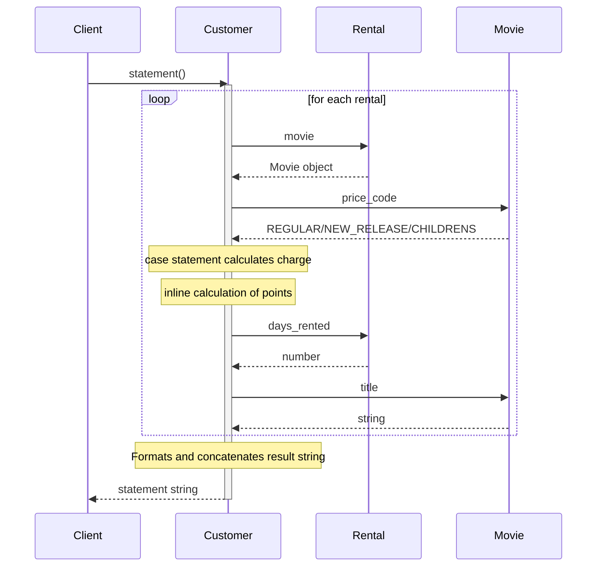
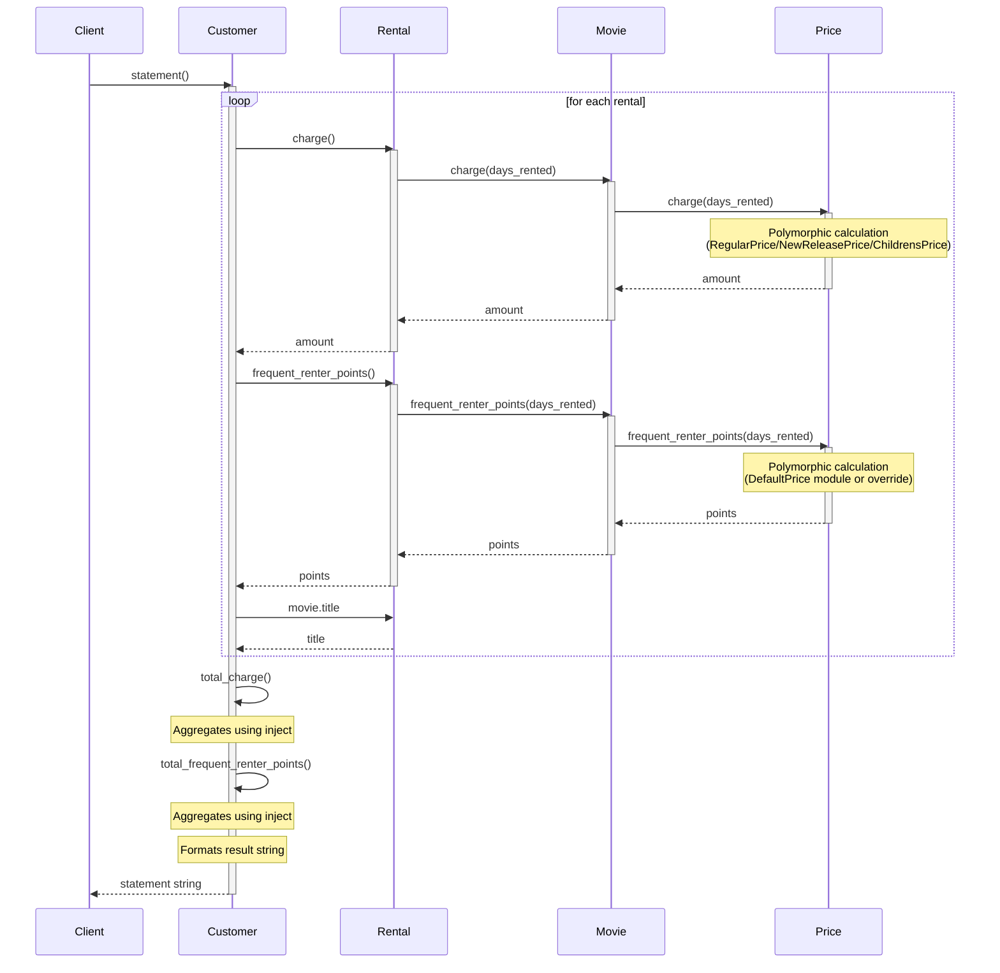

# Refactoring Kata - Chapter 1: Video Rental Statement

A hands-on refactoring exercise from Chapter 1 of "Refactoring: Ruby Edition" by Martin Fowler, Jay Fields, Shane Harvie, and Kent Beck.

## Overview

This kata follows the video rental example from the book's opening chapter. You'll start with working but poorly-designed code and refactor it step-by-step to make it easier to change. The book chapter is included in [chapter_01.txt](book/chapter_01.txt) for reference.

## Current Progress

**Status**: ✅ Step 1 - Extract Method Complete (Commit: dc8d2c7)

| Step | Status | Refactoring | Git Commit |
|------|--------|-------------|------------|
| 0 | ✅ | **Starting Point** - Initial code with tests | 7293cd8 |
| 1 | ✅ | Extract Method: `amount_for` | dc8d2c7 |
| 2 | 🔄 | Rename Variables for clarity | - |
| 3 | ⬜ | Move Method: `Rental#charge` | - |
| 4 | ⬜ | Replace Temp with Query: `this_amount` | - |
| 5 | ⬜ | Extract/Move: Frequent Renter Points | - |
| 6 | ⬜ | Replace Temps: `total_charge`, `total_frequent_renter_points` | - |
| 7 | ⬜ | Move Methods to Movie | - |
| 8 | ⬜ | Replace Type Code with State/Strategy | - |

**Tests**: 8 runs, 8 assertions, 0 failures ✅

## The Problem

A video rental store needs to calculate customer charges and print statements. The initial code works but is hard to modify when new requirements arrive (HTML statements, changing pricing rules).

### Business Rules

**Movie Types (with pricing):**
- **Regular** (price_code = 0): $2 base + $1.50/day after 2 days
- **New Release** (price_code = 1): $3/day
- **Children's** (price_code = 2): $1.50 base + $1.50/day after 3 days

**Frequent Renter Points:**
- 1 point per rental
- Bonus point: New releases rented for more than 1 day get +1 point

### The Challenge

**Upcoming changes:**
1. Users want an HTML version of the statement
2. Movie classification rules will change (but exactly how is unclear)

**The problem:** The long `Customer#statement` method makes these changes hard and error-prone.

## Starting Point Code

### Movie.rb (Simple data class)

```ruby
class Movie
  REGULAR = 0
  NEW_RELEASE = 1
  CHILDRENS = 2

  attr_reader :title
  attr_accessor :price_code

  def initialize(title, price_code)
    @title, @price_code = title, price_code
  end
end
```

### Rental.rb (Links movie to rental duration)

```ruby
class Rental
  attr_reader :movie, :days_rented

  def initialize(movie, days_rented)
    @movie, @days_rented = movie, days_rented
  end
end
```

### Customer.rb (The problematic class!)

```ruby
class Customer
  attr_reader :name

  def initialize(name)
    @name = name
    @rentals = []
  end

  def add_rental(arg)
    @rentals << arg
  end

  def statement
    total_amount, frequent_renter_points = 0, 0
    result = "Rental Record for #{@name}\n"
    @rentals.each do |element|
      this_amount = 0

      # determine amounts for each line
      case element.movie.price_code
      when Movie::REGULAR
        this_amount += 2
        this_amount += (element.days_rented - 2) * 1.5 if element.days_rented > 2
      when Movie::NEW_RELEASE
        this_amount += element.days_rented * 3
      when Movie::CHILDRENS
        this_amount += 1.5
        this_amount += (element.days_rented - 3) * 1.5 if element.days_rented > 3
      end

      # add frequent renter points
      frequent_renter_points += 1
      # add bonus for a two day new release rental
      if element.movie.price_code == Movie::NEW_RELEASE && element.days_rented > 1
        frequent_renter_points += 1
      end

      # show figures for this rental
      result += "\t" + element.movie.title + "\t" + this_amount.to_s + "\n"
      total_amount += this_amount
    end

    # add footer lines
    result += "Amount owed is #{total_amount}\n"
    result += "You earned #{frequent_renter_points} frequent renter points"
    result
  end
end
```

**The problems with this code:**
- The 30+ line `statement` method does everything
- Has a case statement for pricing logic (Customer knows too much!)
- Calculates frequent renter points inline
- Would need to be duplicated for HTML output
- Mixes formatting with calculation
- Movie and Rental are just "dumb" data holders

### Starting Point: Sequence Diagram



**Problems visible in the sequence diagram:**
- Customer does ALL the work (charges, points, formatting)
- Customer knows too much about Movie pricing rules
- Movie and Rental are just "dumb" data holders
- All logic is centralized in one long method

---

## Refactoring Steps - Detailed Progress

### Step 1: Extract Method - `amount_for` ✅

**Book Reference**: Chapter 1, pages 136-161

**What we did:**
Extracted the case statement that calculates charges into a separate `amount_for` method.

**Why?**
> "When I look at a long method like that, I am looking to decompose the method into smaller pieces. Smaller pieces of code tend to make things more manageable."

**Analysis of variables:**
- `element` - not modified, pass as parameter ✅
- `this_amount` - modified, return it ✅

**Code Changes:**

```ruby
# BEFORE - in statement method:
this_amount = 0

# determine amounts for each line
case element.movie.price_code
when Movie::REGULAR
  this_amount += 2
  this_amount += (element.days_rented - 2) * 1.5 if element.days_rented > 2
when Movie::NEW_RELEASE
  this_amount += element.days_rented * 3
when Movie::CHILDRENS
  this_amount += 1.5
  this_amount += (element.days_rented - 3) * 1.5 if element.days_rented > 3
end

# AFTER - extracted method:
this_amount = amount_for(element)

# New method added:
def amount_for(element)
  this_amount = 0
  case element.movie.price_code
  when Movie::REGULAR
    this_amount += 2
    this_amount += (element.days_rented - 2) * 1.5 if element.days_rented > 2
  when Movie::NEW_RELEASE
    this_amount += element.days_rented * 3
  when Movie::CHILDRENS
    this_amount += 1.5
    this_amount += (element.days_rented - 3) * 1.5 if element.days_rented > 3
  end
  this_amount
end
```

**Test Results:** ✅ 8 runs, 8 assertions, 0 failures

**Impact:**
- Statement method is shorter and more focused
- Pricing logic is isolated and can be tested independently
- First step toward better organization

### Step 2: Rename Variables ✅

**Book Reference**: Chapter 1, pages 179-204

**What we did:**
Renamed variables in `amount_for` for clarity:
- `element` → `rental` (describes what it is)
- `this_amount` → `result` (standard convention for return value)

**Why?**
> "Good code should communicate what it is doing clearly, and variable names are a key to clear code. Never be afraid to change the names of things to improve clarity."

Famous quote (page 203):
> **"Any fool can write code that a computer can understand. Good programmers write code that humans can understand."**

**Code Changes:**

```ruby
# BEFORE:
def amount_for(element)
  this_amount = 0
  case element.movie.price_code
  when Movie::REGULAR
    this_amount += 2
    this_amount += (element.days_rented - 2) * 1.5 if element.days_rented > 2
  # ...
  end
  this_amount
end

# AFTER:
def amount_for(rental)
  result = 0
  case rental.movie.price_code
  when Movie::REGULAR
    result += 2
    result += (rental.days_rented - 2) * 1.5 if rental.days_rented > 2
  # ...
  end
  result
end
```

**Test Results:** ✅ 8 runs, 8 assertions, 0 failures

**Impact:**
- Code is more readable - `rental` clearly indicates we're working with a Rental object
- `result` is a standard Ruby convention for the value to be returned
- Small change, big improvement in clarity

---

## The First Step: Build Tests (Chapter 1, page 104-107)

> "Whenever I do refactoring, the first step is always the same. I need to build a solid set of tests for that section of code."

**Before any refactoring:**
1. Create test customers with various rentals
2. Generate statement strings
3. Compare to hand-checked reference strings
4. Use Test::Unit (or RSpec) for self-checking tests
5. Tests must run in seconds and be run often

**Important:** "It is vital to make tests self-checking" - no manual comparison!

## Refactoring Steps

Follow the chapter's progression carefully. The book shows before/after code on facing pages (left = before, right = after). **Test after every change!**

### Part 1: Decomposing and Redistributing the Statement Method (pages 114-453)

#### 1. Extract Method: `amount_for` (page 136-144)
- **What:** Extract the case statement into its own method
- **Variables:** `element` (not modified, pass as parameter), `this_amount` (modified, return it)
- **Book pages 145-161:** Shows the extraction with boldface for changes
- **Test immediately!**

#### 2. Rename Variables (pages 179-204)
- **In `amount_for`:** Rename `element` → `rental`, `this_amount` → `result`
- **Why:** "Good code should communicate what it is doing clearly"
- **Quote (page 203):** "Any fool can write code that a computer can understand. Good programmers write code that humans can understand."
- **Test after renaming!**

#### 3. Move Method: `amount_for` → `Rental#charge` (pages 213-277)
- **Observation (page 214):** `amount_for` uses info from rental, not from customer
- **Rule:** "In most cases a method should be on the object whose data it uses"
- **Steps:**
  1. Copy code to Rental, rename to `charge`, remove parameter (pages 225-227)
  2. Test the new method
  3. Change Customer's `amount_for` to delegate to `rental.charge` (page 232)
  4. Test again
  5. Find all callers and change them to use `element.charge` (pages 242-254)
  6. Test again
  7. Remove old `amount_for` method
- **See Figure 1.3** (page 264) for the new class structure

#### 4. Replace Temp with Query: Remove `this_amount` (pages 287-297)
- **What:** Replace `this_amount` variable with direct calls to `element.charge`
- **Why:** Temps encourage long methods and prevent reuse
- **Performance worry?** "Almost all the time extra method calls won't matter" (page 300)
- **Test!**

#### 5. Extract and Move: Frequent Renter Points (pages 313-334)
- **Extract method** for frequent renter points calculation (page 316)
- **Move to Rental** as `frequent_renter_points` method (page 333)
- **See Figures 1.4-1.7** (pages 353-391) for before/after diagrams
- **Test after each step!**

#### 6. Replace Temp with Query: `total_amount` and `frequent_renter_points` (pages 398-449)
- **Create `total_charge` method** replacing `total_amount` temp (pages 410-426)
- **Use Collection Closure Method:** Apply Ruby's `inject` for conciseness (pages 431-434)
- **Create `total_frequent_renter_points`** method (pages 441-448)
- **See Figures 1.8-1.11** for the transformations
- **Result:** Now `html_statement` is trivial to write! (page 519)

### Part 2: Replacing Conditional Logic with Polymorphism (pages 540-759)

#### 7. Move Methods to Movie (pages 540-596)
- **Move `charge` from Rental to Movie** (pages 551-559)
  - Pass `days_rented` as parameter
  - **Why?** "Type information generally tends to be more volatile" (page 555)
- **Move `frequent_renter_points` to Movie** (pages 566-586)
- **See Figures 1.12-1.13** for the new structure

#### 8. Replace Type Code with State/Strategy (pages 599-759)
- **Goal:** Remove case statements using polymorphism
- **Pattern:** State pattern (object can change price, not class)
- **See Figure 1.14-1.15** for the pattern (pages 608-634)

**Steps:**
1. **Self Encapsulate Field** for price_code (pages 644-665)
2. **Add price classes:** `RegularPrice`, `NewReleasePrice`, `ChildrensPrice` (pages 658-659)
3. **Custom setter** creates price object instances (pages 664-676)
   - Note the irony: "I'm putting in polymorphism to get rid of conditional logic, and the first thing I do is put a case in" (page 677)
4. **Move `charge` to price classes** one type at a time (pages 686-717)
   - Do Regular first, test, then others
   - Movie's charge becomes simple delegator (page 718)
5. **Move `frequent_renter_points`** with DefaultPrice module (pages 723-740)
   - Extract DefaultPrice module for Regular and Children's (pages 736-738)
   - Override in NewReleasePrice
6. **Replace price_code setter** - pass price objects directly (pages 745-757)

**See Figure 1.16-1.17** (pages 762-799) for final interactions and class diagram

## Key Insights from Chapter 1

### The Refactoring Rhythm (page 804)
> "The most important lesson from this example is the rhythm of refactoring: test, small change, test, small change, test, small change."

### When to Refactor (page 100-101)
> "When you find you have to add a feature to a program, and the program's code is not structured in a convenient way to add the feature, first refactor the program to make it easy to add the feature, then add the feature."

### Why Small Steps? (page 172-174)
> "Refactoring changes the programs in small steps. If you make a mistake, it is easy to find the bug."

Fowler's own error story: In the original Java version, he made a mistake in the very first refactoring! But because he tested after each tiny step, it was easy to find.

### Tests Are Essential (page 119-121)
> "Before you start refactoring, check that you have a solid suite of tests. These tests must be self-checking."

### Performance (page 300-506)
Don't worry about calling methods multiple times during refactoring. Focus on clarity first, optimize later with a profiler. "Refactoring often gets opportunities to make better performance improvements."

### State vs Strategy (page 614-617)
Is price a "state of the movie" or an "algorithm for calculating price"? Either view works - the pattern name reflects how you think about it. You can refactor the name later if your thinking changes!

## Final Structure (After All Refactorings)

### Final Sequence Diagram



**Improvements visible in the final sequence diagram:**
- **Proper delegation**: Each object handles its own data
- **Polymorphism**: Price objects handle their specific logic (no case statements!)
- **Tell, Don't Ask**: Customer tells rentals to calculate, doesn't ask for data to calculate itself
- **Single Responsibility**: Each class has one clear job
- **Open/Closed**: Easy to add new price types without modifying existing code

**Key achievements:**
- HTML statement is trivial (page 519-523) - no duplication!
- Adding new movie types: just add a new Price class
- Changing pricing rules: modify one price class
- Zero case statements on price_code!

**Class responsibilities:**
- **Customer**: Manages rentals, formats statements, aggregates totals
- **Rental**: Links movie to duration, delegates to movie
- **Movie**: Manages title and price object, delegates to price
- **Price classes**: Contain all pricing and points logic (polymorphic)

## Example Final Code

See chapter_01.txt pages 658-799 for the complete final code with all price classes, the DefaultPrice module, and the Movie/Rental/Customer classes.

## How to Follow Along

We're working through this kata step-by-step, following the book's progression exactly. Each step will:

1. **Explain the refactoring** (from the book)
2. **Show the code changes** (before/after)
3. **Run tests** to verify nothing broke
4. **Commit to git** to track our progress
5. **Update sequence diagrams** to show OOP evolution

### Key Mindset
- **Trust the process** - The steps seem small, but they compound
- **Test obsessively** - After every tiny change
- **Read the book references** - The page numbers explain the "why"
- **Don't skip ahead** - Each step builds on the previous one

## Source

"Refactoring: Ruby Edition" by Jay Fields, Shane Harvie, Martin Fowler, and Kent Beck
- Chapter 1: "Refactoring, a First Example"
- Full chapter text: [chapter_01.txt](book/chapter_01.txt)

---

**Current Status**: ✅ Starting point complete - Ready for Step 1 (Extract Method)
**Next**: Extract the `amount_for` method from Customer#statement
